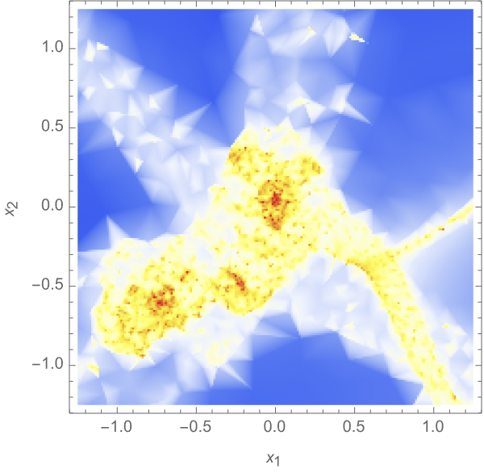
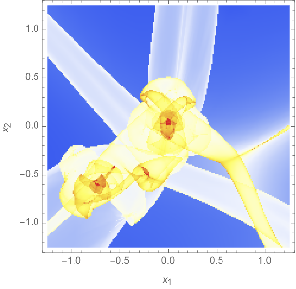
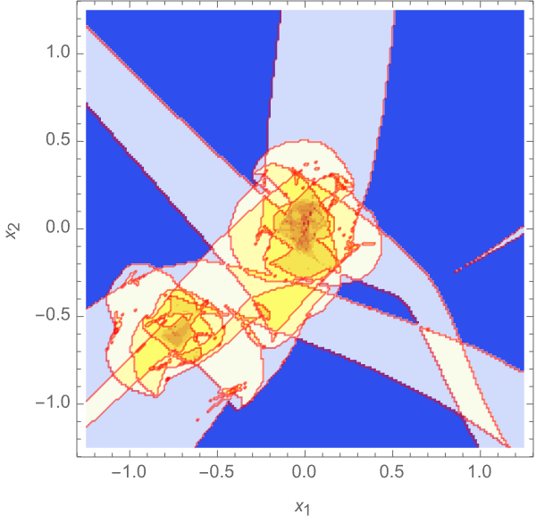

# Phase-Space Delaunay Tessellation Field Estimator

The density and velocity fields of an N-body simulation can be reconstructed with the Phase-Space Delaunay Tessellation Field Estimator implemented in a Python module. This code accompanies the publication [Phase-Space Delaunay Tesselation Field Estimator](https://github.com/jfeldbrugge/PS-DTFE). Please cite this publication when using the code.

Besides the Phase-Space Delaunay Tesselation Field Estimator, the module enables the evaluation of the traditional Delaunay Tesselation Field Estimator and the traditional Phase-Space estimator (see the figure below). We refer to the above-mentioned paper for a brief explanation of these methods and references to the papers where these techniques are developed.

The current implementation uses the numpy, math and scipy modules in Python 3.12, though the code will likely run without much trouble in earlier versions.

In the script Example.py and notebook Example.ipynb we demonstrate how the module can be used for the reconstruction of density and velocity fields.

| | |
|:-------------------------:|:-------------------------:|
|| |
|| |

*Figure 1: The DTFE density field (upper left), the phase-space estimator density field (upper right), the PS-DTFE density field (lower left), and the number of streams (lower right)*
